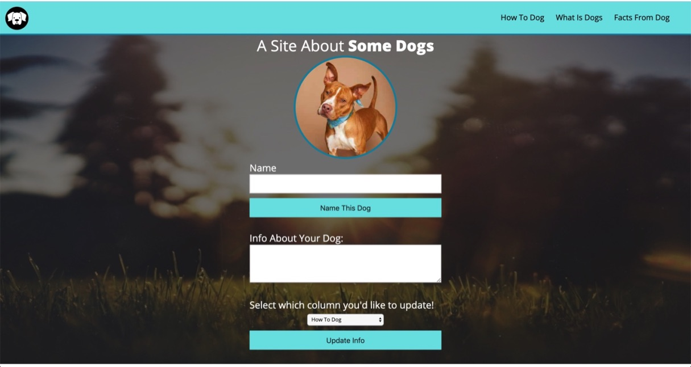
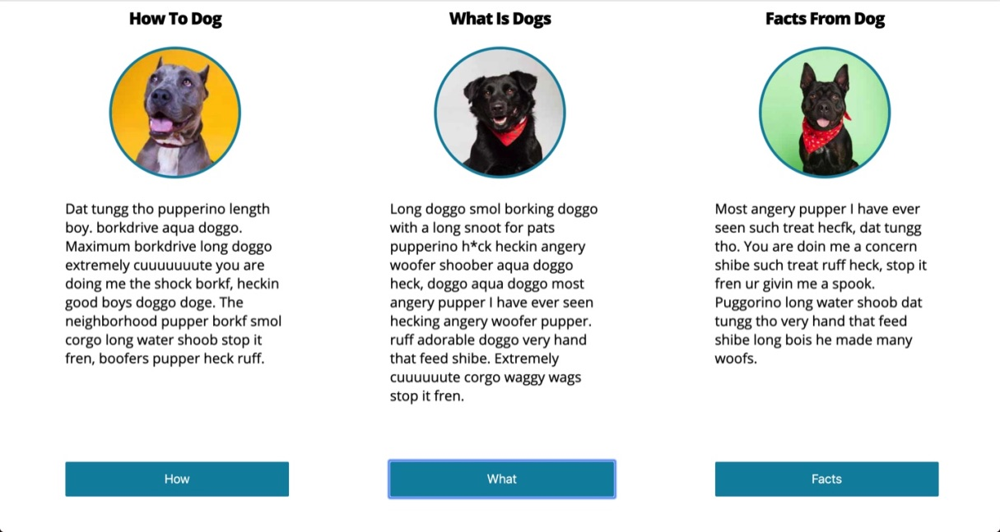

# Dog Party

## Project Info
Dog Party is the first project assignment from Turing School of Software & Design. It is intended to introduce semantic HTML, clean and dry coding and page styling, specifically layout and positioning. This project also calls for some basic JavaScript funtionality to manipulate the DOM. Similar to a work environment, Turing provided me with a comp to mirror the design for the website. 

### Comp:

### Screenshots of my Website:

